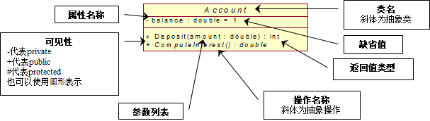
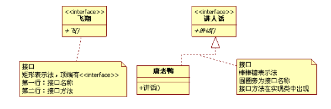
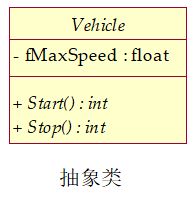
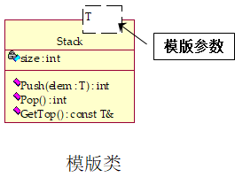

# UML之静态图---类图、对象图(class diagram )

## 什么是类图？
类图一反应类的结构（属性、操作）以及类之间的关系为主要目的，描述了软件系统的结构，是一中静态建模方法。
类图中的“类”与面向对象语言中的“类”的概念是对应的，是对现实世界中事物的抽象。

## 类图产生于什么阶段，由谁来绘制，类图它的作用是什么？
类图产生于设计阶段，由系统设计师绘制，其作用是描述系统的架构结构、指导程序员编码。它包括系统中所有有必要指明的实体类、控制类、界面类及与具体平台有关的所有技术性信息。

## UML类图如何绘制？

### 1. 类的表示

#### 1.1 类的组成
从上到下分为三部分，分别是类名、属性和操作。

#### 1.2 接口
一组操作的集合，只有操作的声明而没有实现。接口图与类图的主要区别在于顶端的<<interface>>显示。第一行是接口名称，第二行是接口方法。接口还有另一种表示方法，俗称棒棒糖表示方法。唐老鸭是能讲人话的唐老鸭，实现了讲人话的接口。如图：

#### 1.3 抽象类
不能被实例化的类，一般至少包含一个抽象操作，与类图的主要区别在于抽象类的名称、方法为斜体。

#### 1.4 模板类
一种参数化的类，在编译时把模板参数绑定到不同的数据类型，从而产生不同的类。

### 2. 类的关系 

#### 2.1关联关系： 
