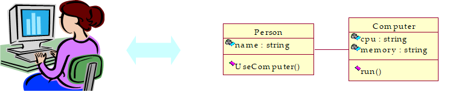

# UML之静态图---类图

## 1.什么是类？
类：类是具有相同属性和服务的一组对象的集合。为属于该类的所有对象提供了统一的抽象描述，其内部包括属性和服务（方法）两个主要部分。
 
## 2.什么是类图？
类图：反应类的结构（属性、操作）以及类之间的关系为主要目的，描述了软件系统的结构，是一中静态建模方法。
类图中的“类”与面向对象语言中的“类”的概念是对应的，是对现实世界中事物的抽象。

## 3.类图产生于什么阶段，由谁来绘制，类图它的作用是什么？
类图产生于设计阶段，由系统设计师绘制，其作用是描述系统的架构结构、指导程序员编码。它包括系统中所有有必要指明的实体类、控制类、界面类及与具体平台有关的所有技术性信息。

## 4.UML类图如何绘制？

### 4.1 类的表示

#### 4.1.1 类的组成
从上到下分为三部分，分别是类名、属性和操作。

#### 4.1.2 接口
一组操作的集合，只有操作的声明而没有实现。接口图与类图的主要区别在于顶端的<<interface>>显示。第一行是接口名称，第二行是接口方法。接口还有另一种表示方法，俗称棒棒糖表示方法。唐老鸭是能讲人话的唐老鸭，实现了讲人话的接口。如图：

#### 4.1.3 抽象类
不能被实例化的类，一般至少包含一个抽象操作，与类图的主要区别在于抽象类的名称、方法为斜体。

#### 4.1.4 模板类
一种参数化的类，在编译时把模板参数绑定到不同的数据类型，从而产生不同的类。  

### 4.2. 类的关系 

#### 4.2.1关联关系： 
描述了类的结构之间的关系，具有方向、名字、角色和多重性等信息。                          

一般的关联关系语义较弱，也有两种语义较强，分别是聚合和组合                  

#### 聚合关系：
特殊关联关系，指明一个聚合（整体）和组成部分之间的关系                       

#### 组合关系：
语义更强的聚合，部分和整体具有相同的生命周期                              

#### 4.2.2、泛化关系：
在面向对象中一般称为继承关系，存在于父类与子类、父接口与子接口                   

#### 4.2.3、实现关系：
 对应于类和接口之间的关系    
 

#### 4.2.4、依赖关系：
UML类图依赖关系是一种使用关系，特定事物的改变有可能会影响到使用该事物的事物，反之不成立。在你想显示一个事物使用另一个事物时使用，两个元素之间的一种关系，其中一个元素（服务者）的变化将影响另一个元素（客户），或向它（客户）提供所需信息。

### 5.类图思维导图

### 6.以机房收费系统为实例绘制类图

#### 首先寻找类，可通过寻找名词，动词来确定
需求过程中的名词组：
| 一般用户 | 操作员 | 管理员 |
| --- | --- | --- | 
| 学生余额 | 学生信息 | 基本数据表 |
| 上机记录 | 充值金额 | 日账单 |
| 充值记录 | 退卡金额 | 周账单 |
| 上机状态 | 操作员工作记录 | 正在值班记录 |

需求过程中的动词组：
| 输入数据 | 修改数据 | 统计 | 退卡 | 结账 | 显示 |
| --- | --- | --- | --- | --- | --- |
| 添加 | 删除 | 查询 | 注册 | 充值 | 打印 |

##### 參考文獻
https://blog.csdn.net/Elsa15/article/details/84700651
